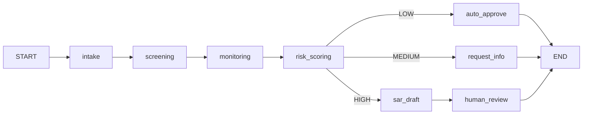

# KYC/AML Agent

Agentic KYC onboarding and AML monitoring system built on **LangGraph**. It ingests customer onboarding documents, screens identities against sanctions/PEP data, monitors transactions with a trained classifier, scores risk deterministically, and routes cases to auto-approve / request-info / human escalation — with a full audit trail on every decision.

## Architecture



**Key design choices:**
- **Human-in-the-loop** — HIGH-risk cases pause at `human_review` via LangGraph `interrupt()`
- **Hybrid ML + LLM** — LightGBM scores transactions; LLMs handle extraction, reasoning, and SAR narrative only
- **Explainable risk** — rules-based tier assignment with reasons in the audit log

## Quick start

Requires [uv](https://docs.astral.sh/uv/) (`curl -LsSf https://astral.sh/uv/install.sh | sh`).

```bash
uv sync --group dev
cp .env.example .env   # add ANTHROPIC_API_KEY

# Download datasets
bash scripts/download_data.sh

# Generate synthetic KYC docs
uv run python -m src.data.generate_kyc_docs

# Train AML classifier
uv run python scripts/train_model.py

# Run tests
uv run pytest tests/ -v
```

## Run the demo

**Streamlit UI:**
```bash
uv run streamlit run src/ui.py
```

**FastAPI:**
```bash
uv run uvicorn src.api:app --reload
```

## Project layout

```
src/
├── state.py           # CaseState schema + audit reducers
├── graph.py           # LangGraph wiring + HITL interrupt
├── config.py          # paths and model names
├── data/              # KYC generation, sanctions, transactions
├── agents/            # intake, screening, monitoring, risk, SAR
├── api.py             # FastAPI endpoint
└── ui.py              # Streamlit demo
```

## Build plan

See [KYC-AML-Agent-Build-Plan.md](KYC-AML-Agent-Build-Plan.md) for the full implementation guide, build order, and interview talking points.

## Data sources

| Dataset | Source | Use |
|---------|--------|-----|
| Sanctions / PEP | [OpenSanctions](https://www.opensanctions.org/) | Identity screening |
| Transactions | [IBM AML (Kaggle)](https://www.kaggle.com/datasets/ealtman2019/ibm-transactions-for-anti-money-laundering-aml) | Train LightGBM detector |
| KYC docs | Faker (generated) | Synthetic onboarding forms |

## License

MIT — portfolio / educational use. Not production compliance software.
